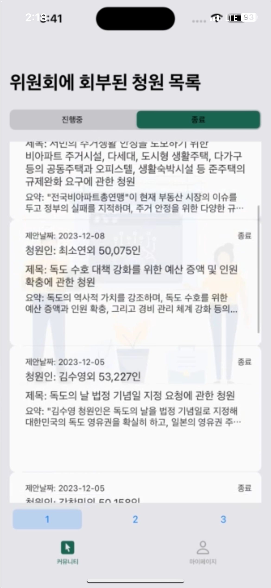
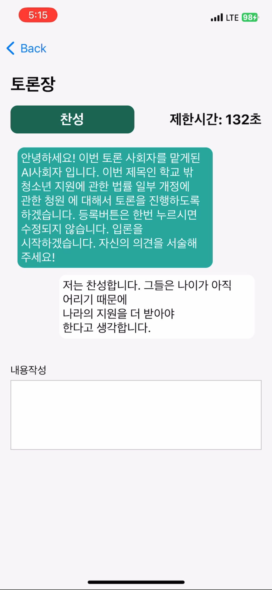
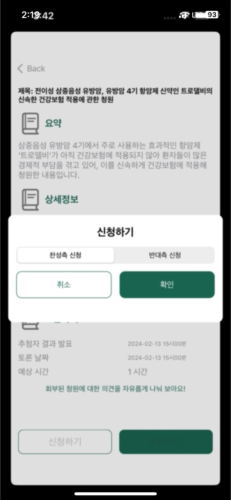
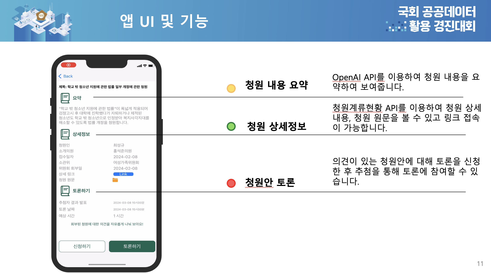

# 👨‍💻 누구나 (NuGuNaa)

> **AI가 중재하는 국민청원 토론 플랫폼**

   

<p align="center">
  
  
  
</p>

<p align="center">
  
</p>

## 📖 프로젝트 소개

**누구나**는 국회 국민청원에 대해 **AI가 중재하는 실시간 토론**을 통해 시민의 목소리를 모으는 iOS 앱입니다.  
국회 공공데이터와 생성형 AI를 결합하여 건설적인 토론 문화를 만듭니다.

### 🏆 수상 내역
**🥇 국회 공공데이터 활용 경진대회 1위 (AI 부문)**

### 💡 개발 배경

**문제 인식**
- 국민청원은 많지만 깊이 있는 토론은 부족
- 찬반 의견이 극단적으로 대립만 할 뿐 건설적 결론 도출 어려움
- 국회는 국민의 다양한 의견을 체계적으로 수렴할 방법 필요

**해결 방안**
- **국회 공공데이터**: 실시간 청원 정보 제공
- **AI 중재 토론**: 생성형 AI가 공정한 토론 중재 및 결과 요약
- **모바일 접근성**: iOS 앱으로 언제 어디서나 참여 가능

---

## ✨ 주요 기능

| 기능 | 설명 |
|------|------|
| 📋 **청원 리스트** | 국회 공공데이터 기반 실시간 청원 목록 (진행 중/종료) |
| 💬 **AI 중재 토론** | 입론 → 반론 → 최종변론 단계별 토론 진행 |
| 🤖 **AI 토론 요약** | 생성형 AI가 토론 내용 분석 및 핵심 요약 제공 |
| ⏱️ **실시간 채팅** | Timer 기반 실시간 의견 교환 시스템 |
| 📊 **토론 결과** | AI가 분석한 토론 결과 및 인사이트 제공 |

---

## 🛠 Tech Stack

### **Core Technologies**
- **Swift** - iOS 네이티브 개발
- **UIKit + Storyboard** - UI 구현
- **MVVM Architecture** - 비즈니스 로직 분리

### **Networking & Data**
- **Alamofire** - RESTful API 통신
- **JWT Authentication** - 사용자 인증 및 세션 관리
- **WebKit** - 청원 상세 내용 표시

### **Key Features**
- **Timer-based Real-time** - WebSocket 없이 실시간 채팅 구현
- **Public Data API** - 국회 공공데이터 연동
- **AI Integration** - 생성형 AI 토론 중재 시스템

---

## 🤝 협업 개발 과정

### **팀 구성**
- iOS 개발 1명 (본인 - 100% 담당)
- Backend 개발 2명
- 기획/디자인 1명

### **주요 협업 성과**

#### 1️⃣ **실시간 토론 시스템 설계**
**역할**  
- 복잡한 토론 플로우(입론-반론-최종변론)를 iOS에서 직관적으로 구현
- 백엔드 API 설계 단계부터 적극 참여하여 모바일 최적화 제안

**성과**  
✅ 단계별 토론 진행을 명확한 UI/UX로 표현  
✅ 서버와 클라이언트 간 효율적인 데이터 구조 확립

---

#### 2️⃣ **JWT 인증 시스템 구축**
**구현**
```swift
let headers: HTTPHeaders = [
    "Authorization": "Bearer \(self.accessToken)"
]

AF.request(url, method: .get, headers: headers)
    .validate()
    .responseDecodable(of: Response.self) { response in
        // 인증된 API 요청 처리
    }
```

**성과**  
✅ 안전한 사용자 세션 관리  
✅ 토큰 만료 시 자동 갱신 로직 구현

---

#### 3️⃣ **혁신적 채팅 솔루션**
**배경**  
서버 환경 제약으로 WebSocket 사용 불가

**해결**
```swift
class CountDownTimer {
    private var timer: Timer?
    private var remainingTime: TimeInterval = 0
    
    func start(duration: TimeInterval, action: @escaping (Int) -> Void) {
        remainingTime = duration
        timer = Timer.scheduledTimer(withTimeInterval: 1, repeats: true) { [weak self] _ in
            guard let self, self.remainingTime > 0 else {
                self?.stop()
                action(0)
                return
            }
            self.remainingTime -= 1
            action(Int(remainingTime))
        }
    }
}
```

**성과**  
✅ Timer 기반 폴링으로 실시간성 확보  
✅ 서버 부하 최소화하면서도 자연스러운 UX 제공

---

#### 4️⃣ **AI 통합 UX 설계**
**역할**  
- 생성형 AI의 토론 중재 결과를 사용자 친화적으로 표현
- 복잡한 AI 응답을 직관적인 UI로 변환

**성과**  
✅ AI의 토론 요약을 읽기 쉬운 카드 UI로 디자인  
✅ 토론 참여자가 AI 피드백을 즉시 이해 가능

---

## 🔑 기술적 도전과 해결

### 1️⃣ **Socket 없는 실시간 통신**

**배경**  
서버 환경 제약으로 WebSocket 사용 불가

**문제**  
실시간 채팅 기능 구현 필요

**해결**  
- Timer + 비동기 처리로 폴링 기반 실시간 채팅 구현
- 1초 간격 자동 갱신으로 실시간성 체감

**성과**  
✅ 제약 조건을 창의적으로 극복  
✅ 사용자가 실시간성을 체감할 수 있는 자연스러운 UX

---

### 2️⃣ **복잡한 토론 플로우 관리**

**배경**  
입론 → 반론 → 최종변론의 단계적 토론 진행

**문제**  
각 단계마다 다른 UI/UX 필요

**해결**  
- MVVM 패턴으로 상태 관리 분리
- 토론 단계별 ViewModel 설계
- Enum으로 토론 상태 명확히 정의

**성과**  
✅ 사용자가 현재 토론 상황을 명확하게 인지  
✅ 유지보수 용이한 코드 구조 확립

---

### 3️⃣ **대용량 청원 데이터 표시**

**배경**  
국회 공공데이터의 복잡하고 긴 청원 내용 처리

**문제**  
외부 브라우저로 이동하면 UX 단절

**해결**  
- WebKit으로 원본 청원을 앱 내에서 seamless하게 표시
- 커스텀 네비게이션으로 일관된 UX 유지

**성과**  
✅ 외부 앱 전환 없이 완성된 사용자 경험  
✅ 청원 내용 조회부터 토론 참여까지 원스톱

---

## 🏆 핵심 성과 및 학습

### 기술적 성과 ✅
- **창의적 문제해결**: 제한된 환경(Socket 없음)에서 실시간 통신 구현
- **100% iOS 담당**: 4명 팀에서 iOS 파트 전체 책임 및 완성
- **효과적 협업**: 백엔드 개발자와 API 설계 단계부터 긴밀히 협력
- **대회 1위 수상**: 기술력과 완성도 인정

### 개인 성장 🎯
- **iOS 전문성 확립**: 대규모 시스템에서 iOS의 역할과 책임 이해
- **협업 역량**: 백엔드/기획팀과의 소통 및 조율 능력 향상
- **제약을 기회로**: 제한적 환경에서 창의적 솔루션 도출 능력 개발
- **책임감**: 팀 프로젝트에서 iOS 파트 100% 완성 책임감 체득

---
## 현재 서비스 종료

---


## 💭 회고 (Retrospective)

### 잘한 점 ✅
- **국회 경진대회 1위**: 기술력과 완성도 인정받음
- **제약 극복**: Socket 없이 실시간 통신 구현
- **완벽한 협업**: 백엔드와 긴밀한 소통으로 프로젝트 완성
- **iOS 100% 담당**: 팀에서 iOS 파트 전체 책임

### 아쉬운 점 📝
- 실제 서비스 배포까지는 이르지 못함
- Socket 기반 실시간 통신 경험 부재
- 테스트 코드 작성 시간 부족

### 다음 프로젝트에 적용할 점 🎯
- WebSocket 기반 실시간 통신 학습 및 적용
- 대회 이후 실제 서비스 출시 도전
- 협업 경험을 바탕으로 프로젝트 매니징 역량 강화
- TDD 방식으로 안정성 높은 코드 작성

---

## 🔗 Links

- **GitHub Repository**: [simoni-git/NuGuNaa](https://github.com/simoni-git/NuGuNaa)
- **국회 공공데이터**: [열린국회정보](https://open.assembly.go.kr/)
---

## 👤 Author

**고민수 (Minsu Go)**
- 📧 Email: gms5889@naver.com
- 💼 GitHub: [@simoni-git](https://github.com/simoni-git)
- 📝 Blog: [네이버 블로그](https://blog.naver.com/gms5889)

---

## 👥 Team

- **iOS Developer**: 고민수 (본인)
- **Backend Developers**: [안순호]
- **PM**: [안효성 , 박선욱]

---

## 📄 License

This project is licensed under the MIT License - see the [LICENSE](LICENSE) file for details.

---
